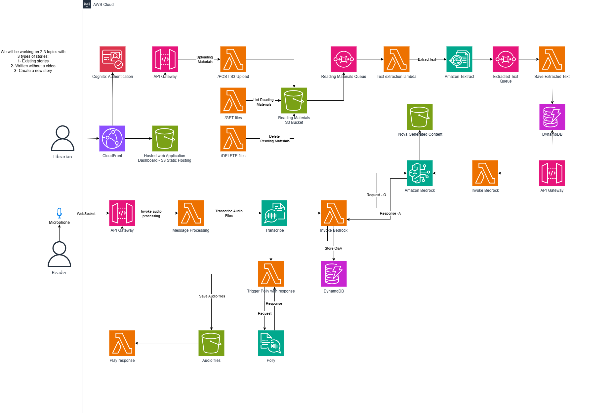

# AWS Deployment Architecture

## Overview

The Nova Hologram platform is deployed on AWS using a serverless architecture. This approach provides scalability, reliability, and cost-effectiveness. The system uses various AWS services to handle different aspects of the application.

## Architecture Diagram

The following diagram illustrates the AWS deployment architecture for the Nova Hologram platform:

The architecture follows a serverless approach, leveraging various AWS services to create a scalable and reliable system.

## Key Components

### Frontend Hosting

The Next.js frontend application is deployed to AWS Amplify, which provides continuous deployment, global CDN distribution, and HTTPS.

### Authentication

User authentication is handled by AWS Cognito, which provides:

- User registration and sign-in
- Multi-factor authentication
- User attribute management
- Role-based access control

### API Layer

AWS API Gateway serves as the API layer, providing:

- RESTful API endpoints
- Request validation
- Authentication and authorization integration with Cognito
- Rate limiting and throttling

### Backend Processing

AWS Lambda functions handle the backend processing, including:

- Book metadata retrieval
- Text extraction from documents
- AI content generation
- File management

### Storage

AWS S3 buckets are used for storage:

- Reading materials bucket: Stores uploaded reading materials
- Generated content bucket: Stores AI-generated holographic content

### Database

Amazon DynamoDB is used as the NoSQL database for storing:

- User preferences and settings
- Reading material metadata
- Content relationships and mappings

### AI Services

- **Amazon Bedrock**: Used for generating holographic videos from text
- **Amazon Textract**: Used for extracting text from uploaded documents

## Deployment Process

The application is deployed using AWS CloudFormation for infrastructure as code. The deployment process includes:

1. Creating and configuring AWS resources
2. Deploying Lambda functions
3. Setting up API Gateway endpoints
4. Configuring Cognito user pools
5. Deploying the frontend application

## Scaling and Performance

The serverless architecture allows the application to scale automatically based on demand:

- Lambda functions scale with the number of requests
- DynamoDB scales with data volume and read/write capacity
- S3 provides virtually unlimited storage
- API Gateway handles request throttling and bursting
