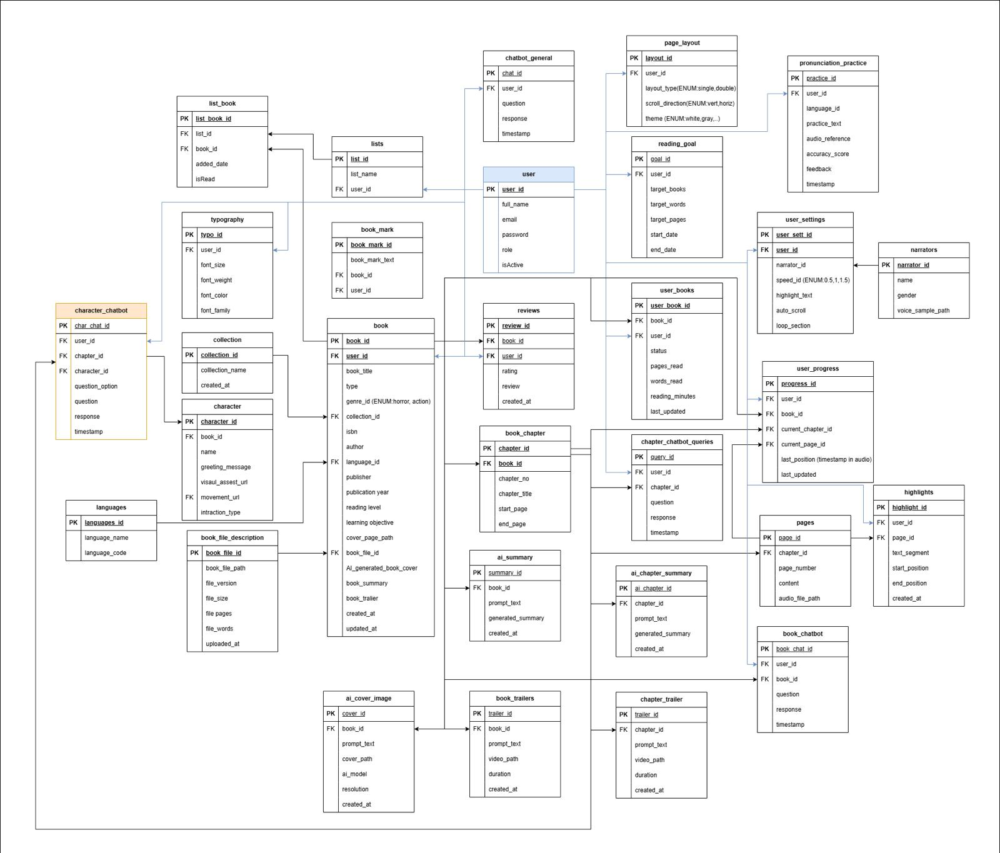

# Database Schema

## Overview

The Nova Hologram platform uses Amazon DynamoDB as its primary database. DynamoDB is a NoSQL database service that provides fast and predictable performance with seamless scalability. This document outlines the database schema used in the application.

## Database Diagram

The following diagram illustrates the database schema for the Nova Hologram platform:



This comprehensive schema shows the relationships between various entities including:

- **User Tables**: Stores user information, authentication details, and preferences
- **Book-related Tables**: Including book, book_mark, book_chapter, etc. to store reading material information
- **Content Tables**: Such as character, collection, typography to manage content presentation
- **Reading-related Tables**: Including reading_goal, page_export to track reading activities
- **Progress Tracking Tables**: Such as user_progress, highlights to monitor user engagement

Each table contains fields with primary keys (PK) and foreign keys (FK) to establish relationships between entities.

## Tables

### Users Table

Stores user information and preferences.

**Table Name**: `Users`

**Primary Key**: `userId` (String)

**Attributes**:

| Attribute | Type | Description |
|-----------|------|-------------|
| userId | String | Unique identifier for the user (from Cognito) |
| email | String | User's email address |
| name | String | User's full name |
| userType | String | Type of user (reader or librarian) |
| createdAt | Number | Timestamp of user creation |
| lastLogin | Number | Timestamp of user's last login |
| preferences | Map | User preferences (theme, language, etc.) |

### ReadingMaterials Table

Stores metadata about uploaded reading materials.

**Table Name**: `ReadingMaterials`

**Primary Key**: `materialId` (String)

**Global Secondary Indexes**:
- `uploaderIndex`: GSI on `uploaderId` to find materials by uploader

**Attributes**:

| Attribute | Type | Description |
|-----------|------|-------------|
| materialId | String | Unique identifier for the reading material |
| title | String | Title of the reading material |
| authors | List | List of authors |
| publisher | String | Publisher name |
| publishedDate | String | Publication date |
| description | String | Description of the material |
| uploaderId | String | ID of the user who uploaded the material |
| uploadDate | Number | Timestamp of upload |
| fileKey | String | S3 key for the file |
| fileType | String | Type of file (PDF, EPUB, etc.) |
| fileSize | Number | Size of the file in bytes |
| maturityRating | String | Maturity rating of the content |
| extractedText | String | Extracted text from the document (if available) |
| status | String | Status of the material (active, deleted, etc.) |

### GeneratedContent Table

Stores metadata about AI-generated holographic content.

**Table Name**: `GeneratedContent`

**Primary Key**: `contentId` (String)

**Global Secondary Indexes**:
- `materialIndex`: GSI on `sourceMaterialId` to find content by source material

**Attributes**:

| Attribute | Type | Description |
|-----------|------|-------------|
| contentId | String | Unique identifier for the generated content |
| title | String | Title of the generated content |
| sourceMaterialId | String | ID of the source reading material |
| generationDate | Number | Timestamp of generation |
| generatedBy | String | ID of the user who generated the content |
| prompt | String | Prompt used for generation |
| fileKey | String | S3 key for the generated video |
| duration | Number | Duration of the video in seconds |
| status | String | Status of the content (processing, ready, error) |
| errorMessage | String | Error message if generation failed |

### UserActivity Table

Tracks user activity and engagement with reading materials and generated content.

**Table Name**: `UserActivity`

**Primary Key**: Composite key of `userId` (Partition Key) and `timestamp` (Sort Key)

**Global Secondary Indexes**:
- `materialIndex`: GSI on `materialId` to find activity by material
- `contentIndex`: GSI on `contentId` to find activity by content

**Attributes**:

| Attribute | Type | Description |
|-----------|------|-------------|
| userId | String | ID of the user |
| timestamp | Number | Timestamp of the activity |
| activityType | String | Type of activity (view, download, generate, etc.) |
| materialId | String | ID of the reading material (if applicable) |
| contentId | String | ID of the generated content (if applicable) |
| duration | Number | Duration of engagement in seconds |
| deviceInfo | Map | Information about the user's device |

## Data Access Patterns

### Common Queries

1. **Get user profile**:
   ```
   GetItem on Users table with userId
   ```

2. **List all reading materials**:
   ```
   Scan on ReadingMaterials table with filter for status = 'active'
   ```

3. **Get reading material details**:
   ```
   GetItem on ReadingMaterials table with materialId
   ```

4. **List materials uploaded by a specific user**:
   ```
   Query on ReadingMaterials table using uploaderIndex with uploaderId
   ```

5. **List generated content for a specific material**:
   ```
   Query on GeneratedContent table using materialIndex with sourceMaterialId
   ```

6. **Get user activity history**:
   ```
   Query on UserActivity table with userId and optional date range on timestamp
   ```

### Data Consistency

The application uses DynamoDB's strong consistency for critical operations and eventual consistency for read-heavy operations to optimize performance and cost.

## Data Migration and Backup

DynamoDB tables are backed up using AWS Backup with point-in-time recovery enabled. Data migration between environments is handled using AWS Database Migration Service (DMS) or custom scripts that export/import data using DynamoDB streams.